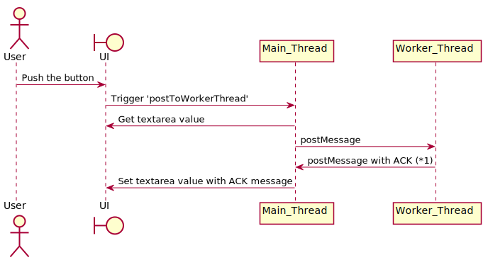

# Typescript WebWorker Sample

This is my sample repo to use WebWorker with Typescript.

`*1` part can also be modified to send data to the backend to make the data storage persistent.

In this sample, the message is sent back to the main thread with the response comment immediately to check the inter-thread processing and the reflection process to the UI.